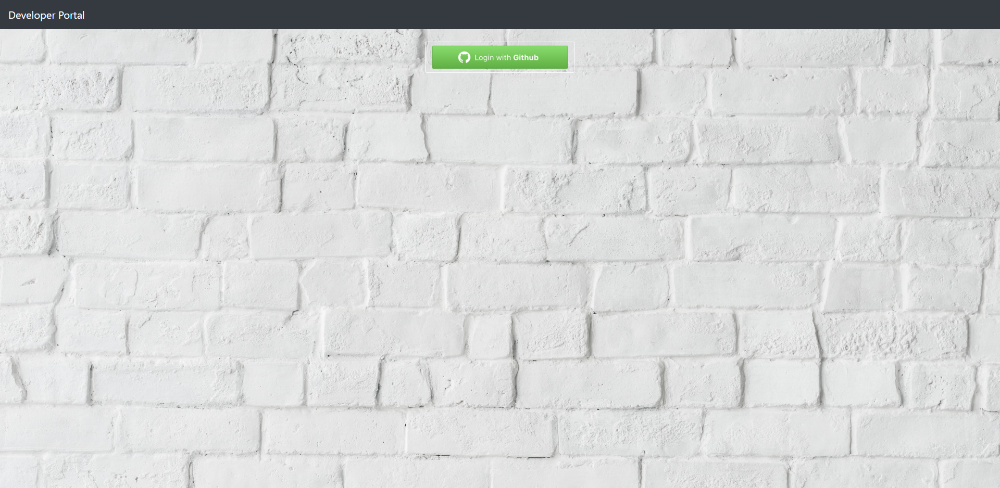
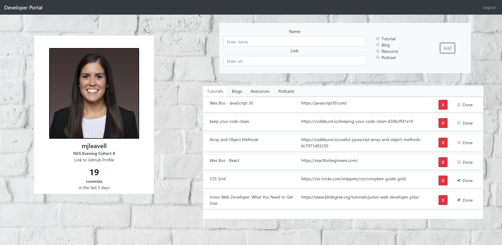

# Developer Portal

### Description
This was a homework assingment for us to practice using React and APIs. 

### Requirements
* As a user, I should be able to easily add learning materials I want to consume later.
* When adding a new learning material I should be able to categorize a material as a tutorial, blog, documentation, or podcast.
* As a user, when I am looking at the list of learning materials they should appear in the correct category tab.
* As a user, I should be able to mark resources as completed. When a resource is marked as completed it should show up at the bottom of the tab it belongs to.
* As a user, I should be able to delete my resources.
* As a user, when I log in via GitHub and the page loads, I should see my username, avatar, bio, url, and the number of commits I have made in the last 5 days

### Technologies Used
* JSX
* Sass
* Bootstrap
* reacstrap
* Axios
* Firebase
* CRUD
* React

### Screenshots
Login

Homepage

### How to run application
[View Live Developer Portal](https://developer-portal-634fa.firebaseapp.com/)

### Contributors
[Maggie Leavell](https://github.com/mjleavell)
